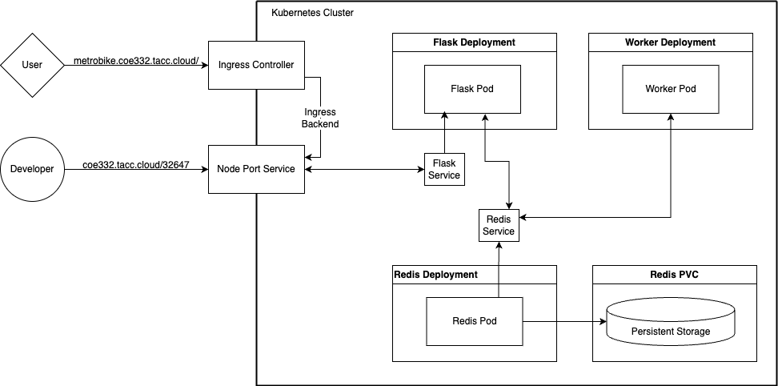
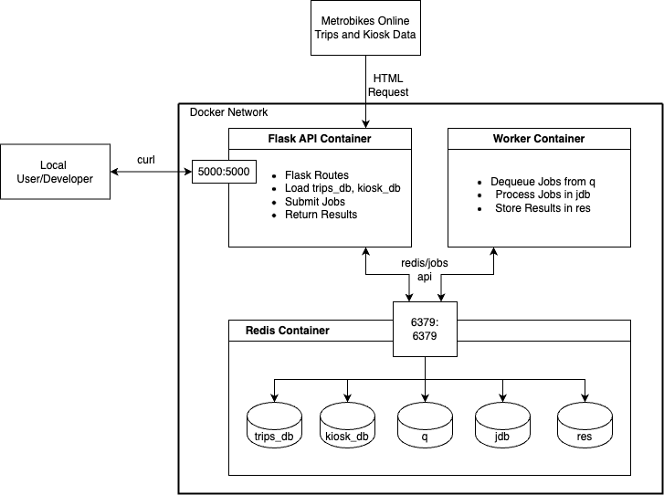

# The MetroBike Insights API

MetroBike is key part of Austin's public transportation infrastructure. Currently the City of Austin provides a public dataset of all metrobike trips as well as a dataset of active and inactive MetroBike kiosks. Our application synergizes these two datasets and provides users an efficent way to explore this data. This repository is used to develop, test and host our MetroBike Data Analysis web application.

## Directory Contents

- `Dockerfile`: Defines the environment for containerizing the Python script.
- `README.md`: Instructions and information about the project.
- `data`: Directory containing data files.
  - `dump.rdb`: Redis database dump file with data pre-loaded.
- `diagram.png`: Diagram image file.
- `docker-compose.yml`: Docker Compose configuration file.
- `requirements.txt`: File containing Python dependencies.
- `src`: Directory containing source code files.
  - `api.py`: Main Python script for managing gene data and providing Flask api endpoints.
  - `jobs.py`: Python script for managing job-related operations.
  - `worker.py`: Python script for managing worker tasks.
- `test`: Directory containing test files.
  - `test_api.py`: Test file for API functionality.
  - `test_jobs.py`: Test file for job-related operations.
  - `test_worker.py`: Test file for worker functionality.
- `kubernetes/`: Directory for files related to hosting the app on the TACC Kubernetes cluster.
  - `prod/`: Kubernetes files specifically for the production deployment.
  - `test/`: Kubernetes files specifically for the test deployment.

## System Architecture
**Kubernetes Deployment Diagram**



**Docker Deployment Diagram**



This software diagram illustrates the components and interactions within the project. It depicts the interactions among the user, a virtual machine hosting a Docker container with Redis, a worker container, and a containerized Flask app all connected with one another for data analysis. It also includes the Kubernetes deployment, showcasing how the Docker containers are orchestrated and managed within the Kubernetes cluster.

## Deployment with Kubernetes

After cloning this repository the Jetstream VM (or any other enviornment configured with the TACC Kubernetes cluster) the web application can be launched on the Kubernetes cluster using the `kubectl apply` command.

For the test enviornment run

```bash
% kubectl apply -f kubernetes/test/
```

For the production enviornment run

```bash
% kubectl apply -f kubernetes/prod/
```

Then `kubectl get` can be used to check if the deployments, services, and ingress resources are running.

```bash
% kubectl get pods
NAME                                   READY   STATUS    RESTARTS   AGE
flask-deployment-7bfd5dc64f-57khg      1/1     Running   0          32m
py-debug-688b84b7b4-55gz6              1/1     Running   0          48m
redis-pvc-deployment-7d7d44c7c-zthkw   1/1     Running   0          48m
worker-deployment-7f7b6c8dfc-9m2cg     1/1     Running   0          48m

% kubectl get services
NAME                               TYPE        CLUSTER-IP     EXTERNAL-IP   PORT(S)          AGE
metrobike-flask-nodeport-service   NodePort    10.233.55.76   <none>        5000:31719/TCP   48m
metrobikeapp-flask-service         ClusterIP   10.233.18.28   <none>        5000/TCP         48m
metrobikeapp-redis-service         ClusterIP   10.233.57.22   <none>        6379/TCP         48m

% kubectl get ingress
NAME                         CLASS   HOSTS                         ADDRESS                                                    PORTS   AGE
metrobikeapp-flask-ingress   nginx   metrobike.coe332.tacc.cloud   129.114.36.240,129.114.36.49,129.114.36.83,129.114.38.92   80      49m
```

Now the web application should be running with a public api end point at `metrobike.coe332.tacc.cloud`

## Local Deployment with Docker-Compose

After cloning this repository use `docker compose` to run the services locally.

To force build the images locally use

```bash
% docker compose up -d --build
```

Otherwise ommiting the `--build` flag will pull the images `williamzhang0306/metro_bike_app:dev` and `redis/7` from docker hub.

```bash
% docker compose up -d
```

The `-d` flag means the services are run in detached mode (in the background). To check if they are running use `docker ps`.

```bash
% docker ps
CONTAINER ID   IMAGE                                 COMMAND                  CREATED         STATUS         PORTS                                       NAMES
5c897dbfe1e5   williamzhang0306/metro_bike_app:dev   "python3 api.py"         6 minutes ago   Up 6 minutes   0.0.0.0:5000->5000/tcp, :::5000->5000/tcp   metrobikedata_api_1
e652aa9b0e23   williamzhang0306/metro_bike_app:dev   "python3 worker.py"      6 minutes ago   Up 6 minutes                                               metrobikedata_worker_1
997079d905f6   redis:7                               "docker-entrypoint.s…"   6 minutes ago   Up 6 minutes   0.0.0.0:6379->6379/tcp, :::6379->6379/tcp   metrobikedata_redis-db_1
```

Now the flask api should be accessible locally on `localhost:5000`.

## Flask Routes

The MetroBike Data Analysis Web Application supports the following routes.

### `/data`

A `POST` request to the `/data` will pull the publicly hosted MetroBike Trips data and MetroBike Kiosk data and then load them into the redis database. The user must specify the number of rows from the Trips data base to load.

Example - public api endpoint (Kubernetes)

```bash
% curl -X POST metrobike.coe332.tacc.cloud/data -d '{"rows":"100000"}' -H "Content-Type: application/json"
Loaded 100000 trips and 102 kiosks into Redis databases.
```

Example - locally hosted (Docker)

```bash
% curl -X POST localhost:5000/data -d '{"rows":"100000"}' -H "Content-Type: application/json"
Loaded 100000 trips and 102 kiosks into Redis databases.
```

A `DELETE` request will delete all trips and kiosk data in the redis database

Example - public api endpoint (Kubernetes)

```bash
% curl -X DELETE metrobike.coe332.tacc.cloud/data
Deleted trips and kiosks data.
```

Example - locally hosted (Docker)

```bash
% curl -X DELETE localhost:5000/data
Deleted trips and kiosks data.
```

### `/trips`

A `GET` request to `/trips` will return a json list of the trips that fit the query parameters. The supported query paramaters are

- `start_date`: in `MM/DD/YYYY` format
- `end_date`: in `MM/DD/YYYY` format
- `latitude`: latitude in degrees
- `longitude`: longitude in degrees
- `radius`: the radius to search within in miles

Example - public api endpoint (Kubernetes)

```bash
% curl "metrobike.coe332.tacc.cloud/trips?start_date=01/03/2023&end_date=01/03/2024&latitude=30.286&longitude=-97.739&radius=5"
```

Example - locally hosted (Docker)

```bash
% curl "localhost:5000/trips?start_date=01/03/2023&end_date=01/03/2024&latitude=30.286&longitude=-97.739&radius=5"
```

### `/kiosk_ids`

A `GET` request to `/kiosk_ids` will return a list of all available kiosk IDs.

Example - public api endpoint (Kubernetes)

```bash
% curl "metrobike.coe332.tacc.cloud/kiosk_ids"
```

Example - locally hosted (Docker)

```bash
% curl "localhost:5000/kiosk_ids"
```

### `/nearest`

A `GET` request to `/nearest` will print the n nearest kiosks to a given location along with their details.

Query Parameters:

- `n`: Number of nearest kiosks to display
- `lat`: Latitude of the location
- `long`: Longitude of the location

Example - public api endpoint (Kubernetes)

```bash
% curl "metrobike.coe332.tacc.cloud/nearest?n=5&lat=30.2862730619728&long=-97.73937727490916"
Nearest Kiosks:
- Kiosk Name: UT West Mall @ Guadalupe, Kiosk ID: 2548, Distance: 0.24 mi, Status: active 
- Kiosk Name: 21st & University, Kiosk ID: 3797, Distance: 0.30 mi, Status: active 
- Kiosk Name: Guadalupe & 21st, Kiosk ID: 2547, Distance: 0.36 mi, Status: active 
- Kiosk Name: Dean Keeton & Whitis, Kiosk ID: 3795, Distance: 0.40 mi, Status: active 
- Kiosk Name: 21st & Speedway @PCL, Kiosk ID: 3798, Distance: 0.41 mi, Status: active 
```

Example - locally hosted (Docker)

```bash
% curl "localhost:5000/nearest?n=5&lat=30.2862730619728&long=-97.73937727490916"
```

### `/show_nearest`

A `GET` request to `/show_nearest` will plot the n nearest kiosks to a given location on a map. This route can only be run on a web browser.

Query Parameters:

- `n`: Number of nearest kiosks to display
- `lat`: Latitude of the location
- `long`: Longitude of the location

Example browser url - public api endpoint (Kubernetes): `http://metrobike.coe332.tacc.cloud/show_nearest?n=5&lat=30.2862730619728&long=-97.73937727490916`

Example browser url - locally hosted (Docker): `http://localhost:5000/show_nearest?n=5&lat=30.2862730619728&long=-97.73937727490916`

### `/jobs`

This route accepts `POST` requests to submit job requests for creating a Trips Per Day and Trip Duration plot.

Parameters:

- `start_date`: Start date of the analysis period (MM/DD/YYYY)
- `end_date`: End date of the analysis period (MM/DD/YYYY)
- `radius`: Radius in miles for spatial analysis
- `latitude`: Latitude of the location for analysis (degrees)
- `longitude`: Longitude of the location for analysis (degrees)
- `plot_type`: Type of plot to generate, options are 'trip_duration' or 'trips_per_day'

Example - public api endpoint (Kubernetes)

```bash
% curl -X POST metrobike.coe332.tacc.cloud/jobs -d '{"kiosk1":"3795", "kiosk2":"2548", "start_date":"01/31/2023", "end_date":"01/31/2024", "plot_type":"trip_duration"}' -H "Content-Type: application/json"
{
  "id": "5d3596e3-2dd6-4efc-9f7c-5c558e7483ca",
  "job parameters": {
    "end_date": "01/31/2024",
    "kiosk1": "4055",
    "kiosk2": "2498",
    "plot_type": "trip_duration",
    "start_date": "01/31/2023"
  },
  "status": "submitted"
}
```

Example - locally hosted (Docker)

```bash
% curl -X POST localhost:5000/jobs -d '{"start_date": "01/31/2023", "end_date":"01/31/2024", "latitude":"30.286", "longitude":"-97.739", "radius":"3", "plot_type":"trips_per_day"}' -H "Content-Type: application/json"
{
  "id": "50993b9f-9e73-4593-89ba-1d0c1d224726",
  "job parameters": {
    "end_date": "01/31/2024",
    "lat": "30.286",
    "long": "-97.739",
    "plot_type": "trips_per_day",
    "radius": "3",
    "start_date": "01/31/2023"
  },
  "status": "submitted"
}
```


### `/jobs/<job_id>`

This route handles `GET` requests to retrieve information about a specific job identified by its unique `job_id`.

Example public api endpoint (Kubernetes)

```bash
% curl metrobike.coe332.tacc.cloud/jobs/5d3596e3-2dd6-4efc-9f7c-5c558e7483ca
{
  "id": "5d3596e3-2dd6-4efc-9f7c-5c558e7483ca",
  "job parameters": {
    "end_date": "01/31/2024",
    "kiosk1": "4055",
    "kiosk2": "2498",
    "plot_type": "trip_duration",
    "start_date": "01/31/2023"
  },
  "status": "complete"
}
```

Example - locally hosted (Docker)
```bash
% curl localhost:5000/jobs/50993b9f-9e73-4593-89ba-1d0c1d224726
{
  "id": "50993b9f-9e73-4593-89ba-1d0c1d224726",
  "job parameters": {
    "end_date": "01/31/2024",
    "lat": "30.286",
    "long": "-97.739",
    "plot_type": "trips_per_day",
    "radius": "3",
    "start_date": "01/31/2023"
  },
  "status": "complete"
}
```

### `/results/<job_id>`

This route handles `GET` requests to retrieve job results associated with a specific `job_id`. If the job has not yet completed, it will return a message indicating the current status.

Example public api endpoint (Kubernetes)

```bash
% curl -o trip_duration.png metrobike.coe332.tacc.cloud/results/5d3596e3-2dd6-4efc-9f7c-5c558e7483ca
```

Example - locally hosted (Docker)
```bash
% curl -o trips_per_day.png localhost:5000/results/50993b9f-9e73-4593-89ba-1d0c1d224726
```

### `/help`
This route provides a menu for users to learn about the available commands of the program.

Example public api endpoint (Kubernetes)

```bash
% curl metrobike.coe332.tacc.cloud:5000/help
```

Example - locally hosted (Docker)

```bash
% curl localhost:5000/help
```

## Running Unit Tests

In order to run unit tests on the Flask routes, worker, and jobs files, you can enter an interactive terminal within the api container and running `pytest`.
An example output is shown below:

```bash
% docker-compose exec api /bin/bash
root@a6eb49dc2333:/code# pytest
=================================================================== test session starts ===================================================================
platform linux -- Python 3.8.10, pytest-8.0.0, pluggy-1.5.0
rootdir: /code
collected 10 items                                                                                                                                        

test_api.py .....                                                                                                                                   [ 50%]
test_jobs.py ...                                                                                                                                    [ 80%]
test_worker.py ..                                                                                                                                   [100%]

=================================================================== 10 passed in 11.87s ===================================================================
```

## 7. Clean Up

Do not forget to stop and remove the container once you are done interacting with the Flask microservice using:

```bash
% docker-compose down
```

You can make sure the container has been stopped and removed by running:

```bash
% docker ps -a
```

This process ensures resource efficiency and prevents conflicts in subsequent container executions. Note: The data in redis, once posted, will persist even after you stop and remove the containers or the Docker images themselves with `docker rmi`.

## Interpreting the Output

The API endpoints provide access to Austin MetroBike dataset, allowing users to load, retrieve, and delete travel information stored in a Redis database. The data includes unique identifiers for each kiosk (kiosk_id) as well as additional details about each trip. If you have access to a web broswer, you can also visualize the n nearest kiosks to a provided location as well as their availability.

## Acknowledgments

The MetroBike Insights API project utilizes data provided by the [City of Austin MetroBike Dataset](https://data.austintexas.gov/resource/qd73-bsdg.json). The README content and instructions were created with the assistance of ChatGPT, an AI language model developed by OpenAI.