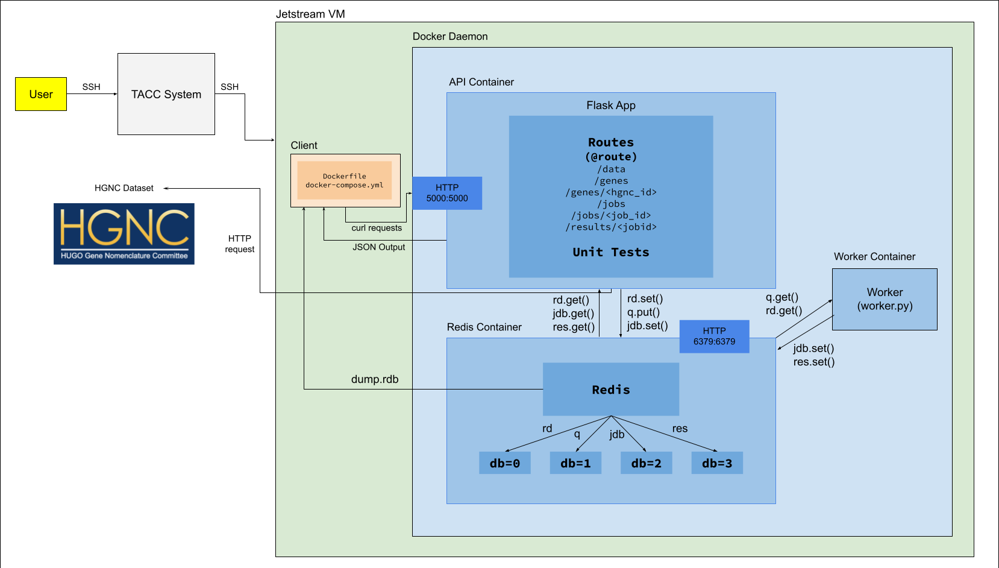

# Gene API

## Project Objective

The objective of the Gene API project is to create a Flask-based application for managing and querying gene data from the Human Genome Organization (HUGO) Gene Nomenclature Committee (HGNC). The primary script downloads the complete set of HGNC data, injects it into a Redis database, and provides an interface for querying gene information.

## Contents

- `Dockerfile`: Defines the environment for containerizing the Python script.
- `README.md`: Instructions and information about the project.
- `data`: Directory containing data files.
  - `dump.rdb`: Redis database dump file with data pre-loaded.
- `diagram.png`: Diagram image file.
- `docker-compose.yml`: Docker Compose configuration file.
- `requirements.txt`: File containing Python dependencies.
- `src`: Directory containing source code files.
  - `api.py`: Main Python script for managing gene data and providing API endpoints.
  - `jobs.py`: Python script for managing job-related operations.
  - `worker.py`: Python script for managing worker tasks.
- `test`: Directory containing test files.
  - `test_api.py`: Test file for API functionality.
  - `test_jobs.py`: Test file for job-related operations.
  - `test_worker.py`: Test file for worker functionality.

## System Architecture



This software diagram illustrates the components and interactions within the project. It depicts the interactions among the user, a virtual machine hosting a Docker container with Redis, a worker container, and a containerized Flask app all connected with one another for data analysis. This diagram provides a visual overview of the project's structure and workflow, facilitating understanding of its functionality and components.

## Instructions

### 1. Accessing the HGNC Data

The HGNC data can be retrieved from the [HGNC website](https://www.genenames.org/download/archive/). Scroll to the bottom of the page and locate the link that says "Current tab separated hgnc_complete_set file" or "Current JSON format hgnc_complete_set file". This file contains comprehensive information about gene names and identifiers approved by the HGNC.

### 2. Building the Container

To build the Docker container for the Gene App, follow these steps:

1. Make sure you have Docker installed on your system and the Docker daemon is running. If not, download and install Docker from [the official Docker website](https://docs.docker.com/get-docker/).

2. Navigate to the directory containing the `Dockerfile` and the Python script `gene_api.py` using the terminal or command prompt.

3. Run the following command to build the Docker image and get the Flask app running in the background:

   ```bash
   docker-compose up -d
   ```

   This command builds the Docker image `gene_api` with the tag `latest` and simultaneously launches Redis with the tag `7` (to account for semantic versioning) on port 6379. Both services run in the background.

4. Wait for Docker to complete the build process. Use `docker ps -a` to ensure that both the Gene API and Redis containers are running. The Redis container should be mapped to port 6379.

The Flask app is now ready to use. You can further confirm that it was built successfully by running `docker images` to list all available images on your system.

### 3. Accessing the Routes

Once the Docker container is running, you can access various routes in the Gene API app using `curl` commands or by sending HTTP requests programmatically. The routes below enable you to interact with different aspects of the Gene API and retrieve relevant information. Here are the available routes and their descriptions:

#### 3.1. `curl -X [REQUEST] localhost:5000/data`

- POST: Load the HGNC data to the Redis database. Use a POST request to this endpoint with no additional parameters. Note: This request may take up to 1 minute to process as it is a very large dataset.

- GET: Retrieve all gene data from the Redis database. Use a GET request to this endpoint to fetch the data as a JSON list.

- DELETE: Delete all gene data from the Redis database. Use a DELETE request to this endpoint with no additional parameters.

#### 3.2. `curl localhost:5000/genes`

- GET: Retrieve a JSON-formatted list of all gene IDs (hgnc_id fields) available in the dataset.

#### 3.3. `curl localhost:5000/genes/<hgnc_id>`

- GET: Retrieve all data associated with a specific gene ID. Replace <hgnc_id> in the URL with the desired gene ID to query.
  Sample output:

```bash
% curl localhost:5000/genes/HGNC:56802
  {"hgnc_id": "HGNC:56802", "name": "RPL7L1 pseudogene 20", "refseq_accession": ["NG_009836"], "symbol": "RPL7L1P20", "status": "Approved", "entrez_id": "442161", "date_approved_reserved": "2023-04-19", "location_sortable": "06p24.3", "_version_": 1793942620136800258, "uuid": "1ff5fcae-9fad-463c-9522-419befbcedaa", "locus_type": "pseudogene", "pseudogene.org": "PGOHUM00000301251", "locus_group": "pseudogene", "location": "6p24.3", "date_modified": "2023-04-19", "ensembl_gene_id": "ENSG00000216781"}
```

These routes provide comprehensive access to the Gene API's functionalities and data.

### 4. Submitting A Job

To submit a job to the web application, you can use the `/jobs` route. The following `curl` command demonstrates how to submit a job:

```bash
curl -X POST localhost:5000/jobs -d '{"gene1":"HGNC:24523", "gene2":"HGNC:29027"}' -H "Content-Type: application/json"
```

This command sends a POST request to the `/jobs` route with the required parameters: `gene1` and `gene2`. These are the two genes you want to find similarities between. Below is a sample output after submitting the job:

```bash
% curl -X POST localhost:5000/jobs -d '{"gene1":"HGNC:24523", "gene2":"HGNC:29027"}' -H "Content-Type: application/json"
{"id": "43bcd7c2-c183-4fe4-9be9-d34ac6b01082", "status": "submitted", "gene1": "HGNC:24523", "gene2": "HGNC:29027"}
```

To check the status of the submitted job, you can use the `/jobs/<jobid>` route, replacing `<jobid>` with the ID of the job you want to check. The following `curl` command demonstrates how to check the status of the job created above along with the expected output:

```bash
% curl localhost:5000/jobs/a376dd30-ef71-4c26-9fa2-50fdde4f7f48
{"id": "a376dd30-ef71-4c26-9fa2-50fdde4f7f48", "status": "in progress", "gene1": "HGNC:24523", "gene2": "HGNC:29027"}
```

As jobs complete, the status will change to "complete." To check the progress and IDs of all jobs, use a GET request to the `/jobs` route. This is the expected output of `/jobs` if we simulate a user (or multiple users) running several jobs at the same time:

```bash
% curl localhost:5000/jobs
Job ID: a376dd30-ef71-4c26-9fa2-50fdde4f7f48 | Status: complete | gene1: HGNC:24523 | gene2: HGNC:29027
Job ID: b3a5f5b2-c9b9-4bdc-8c5c-84f884441106 | Status: submitted | gene1: HGNC:24523 | gene2: HGNC:29027
Job ID: 57dec542-94e8-4150-8f6f-6b44aaf48a3a | Status: submitted | gene1: HGNC:24523 | gene2: HGNC:29027
Job ID: 6208a542-c003-4f0f-a86d-ba310c1784eb | Status: in progress | gene1: HGNC:24523 | gene2: HGNC:29027
Job ID: 43bcd7c2-c183-4fe4-9be9-d34ac6b01082 | Status: complete | gene1: HGNC:24523 | gene2: HGNC:29027
Job ID: 9f8c1ce8-ecff-43c4-9bd9-8a09e56f86ed | Status: complete | gene1: HGNC:24523 | gene2: HGNC:29027
Job ID: dc7226e7-f090-4697-8e3a-17dbf04f36ab | Status: submitted | gene1: HGNC:24523 | gene2: HGNC:29027
Job ID: e78e851f-132a-4475-8c44-83387e558ecf | Status: submitted | gene1: HGNC:24523 | gene2: HGNC:29027
```

We can notice from the output the queue in Redis processes jobs one at a time in the order the jobs were submitted.

### 5. Getting Results

In order to get the results of a job, use the `/results/<job_id>` route. Here is a sample output from the results of one of the jobs shown in the previous section:

```bash
% curl localhost:5000/results/6208a542-c003-4f0f-a86d-ba310c1784eb
Similarities between HGNC:24523 and HGNC:29027:
locus_group: protein-coding gene
date_name_changed: 2016-02-12
date_modified: 2023-01-20
locus_type: gene with protein product
status: Approved
```

### 6. Running Unit Tests

In order to run unit tests on the Flask routes, worker, and jobs files, you can enter an interactive terminal within the api container and running `pytest`.
An example output is shown below:

```bash
% docker-compose exec api /bin/bash
root@f9d1b4516a39:/code# pytest
====================================================================== test session starts =======================================================================
platform linux -- Python 3.8.10, pytest-8.0.0, pluggy-1.4.0
rootdir: /code
collected 11 items

test_api.py ......                                                                                                                                         [ 54%]
test_jobs.py ....                                                                                                                                          [ 90%]
test_worker.py .                                                                                                                                           [100%]

======================================================================= 11 passed in 9.04s =======================================================================
```

### 7. Clean Up

Do not forget to stop and remove the container once you are done interacting with the Flask microservice using:

```bash
docker-compose down
```

You can make sure the container has been stopped and removed by running:

```bash
docker ps -a
```

This process ensures resource efficiency and prevents conflicts in subsequent container executions. Note: The data in redis, once posted, will persist even after you stop and remove the containers or the Docker images themselves with `docker rmi`.

## Interpreting the Output

The API endpoints provide access to gene data from the HGNC dataset, allowing users to load, retrieve, and delete gene information stored in a Redis database. The data includes unique identifiers for each gene (hgnc_id) as well as additional details about each gene.

## Acknowledgments

The Gene API project utilizes data provided by the Human Genome Organization (HUGO) Gene Nomenclature Committee (HGNC). The README content and instructions were created with the assistance of ChatGPT, an AI language model developed by OpenAI.
